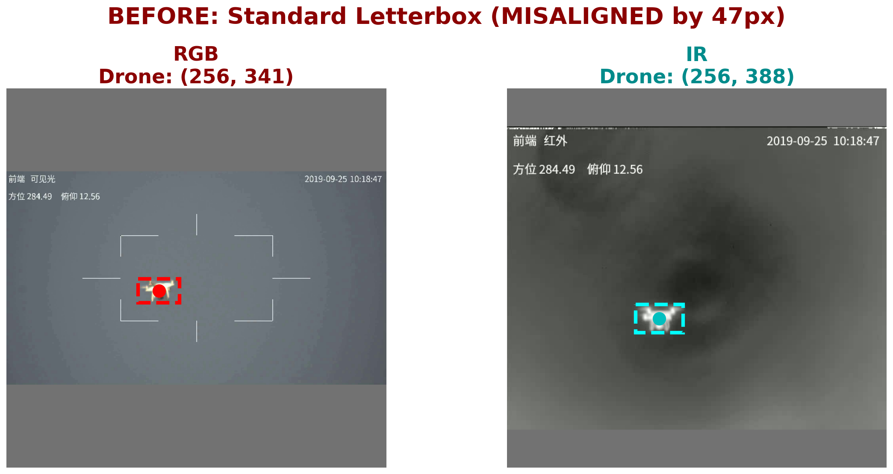
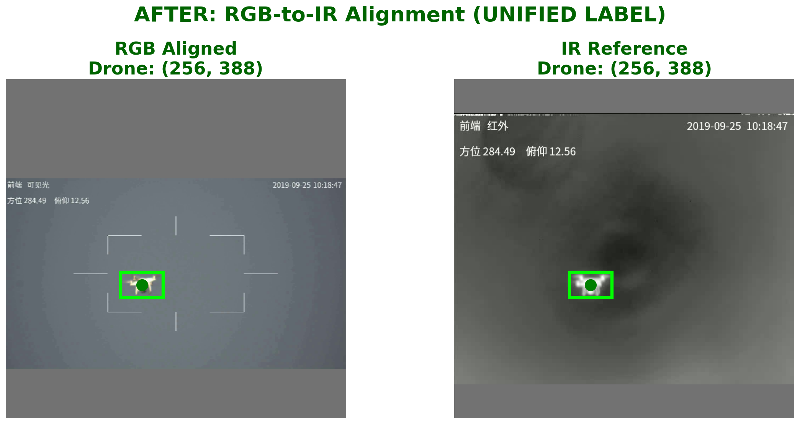
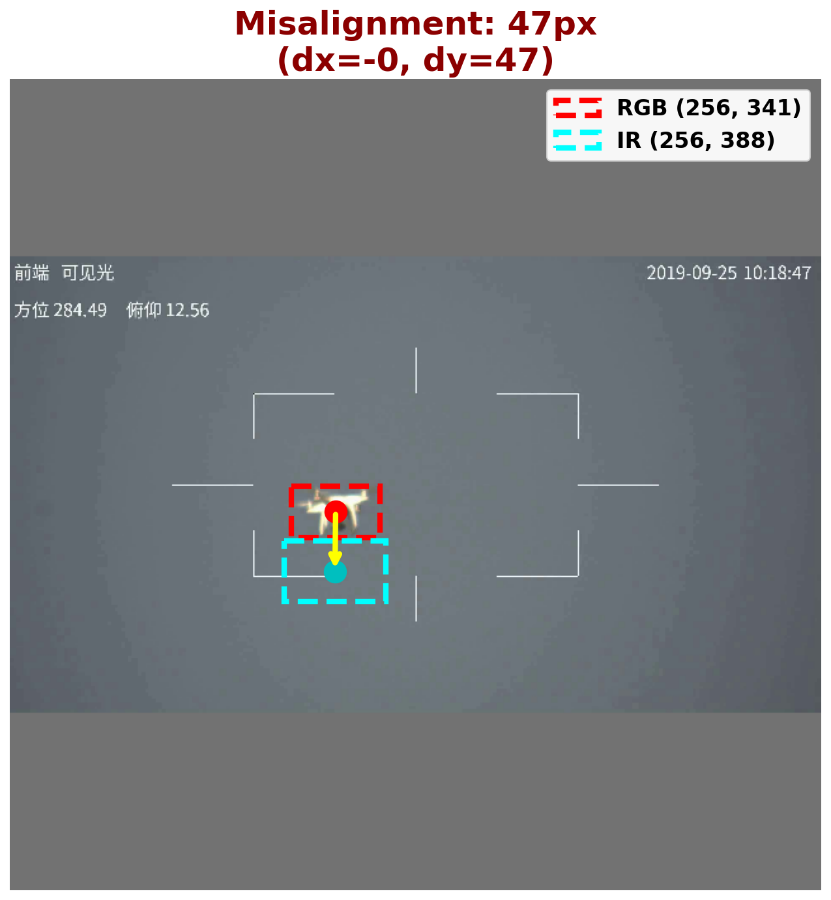
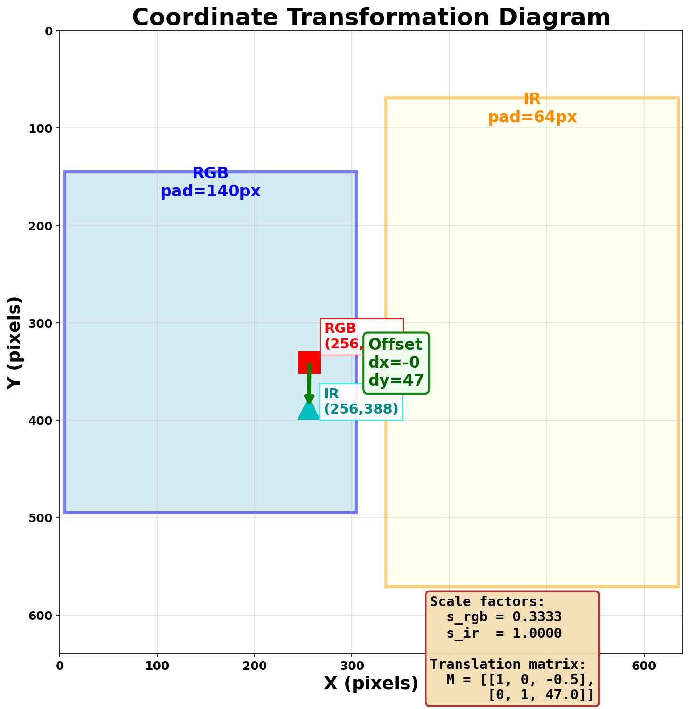
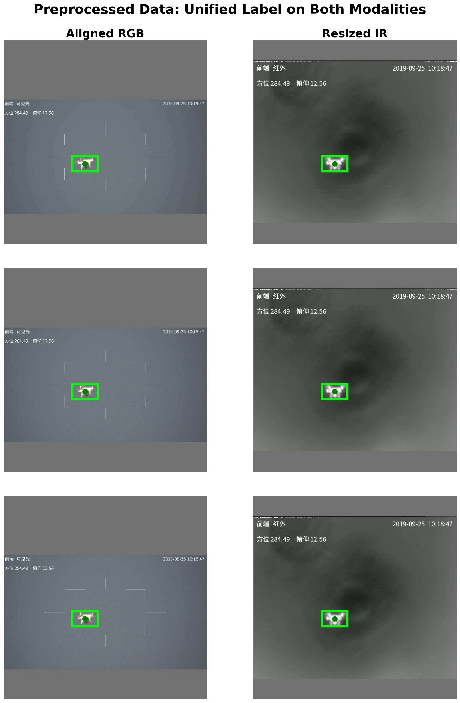

# Multi-Modal Data Preprocessing: RGB-IR Spatial Alignment

This document describes the preprocessing methodology used to spatially align RGB and IR images for multi-modal sensor fusion in UAV detection.

---

## Table of Contents

1. [Problem Statement](#1-problem-statement)
2. [Mathematical Formulation](#2-mathematical-formulation)
3. [RGB-to-IR Alignment Solution](#3-rgb-to-ir-alignment-solution)
4. [Visual Comparison](#4-visual-comparison)
5. [Implementation](#5-implementation)
6. [Usage](#6-usage)

---

## 1. Problem Statement

Multi-modal sensor fusion requires that features from different modalities correspond to the same spatial locations. RGB and IR cameras typically have different resolutions and aspect ratios, leading to different scaling factors during resizing.

When both images are independently resized to a common target size using standard letterboxing, the same real-world object may appear at **different pixel locations** in the two images. This spatial misalignment degrades fusion performance.

---

## 2. Mathematical Formulation

### 2.1 Letterbox Resizing

Standard letterbox resizing maintains aspect ratio by scaling and padding:

$$
s = \min\left(\frac{T}{W}, \frac{T}{H}\right)
$$

$$
p_x = \left\lfloor \frac{T - \lfloor W \cdot s \rfloor}{2} \right\rfloor, \quad p_y = \left\lfloor \frac{T - \lfloor H \cdot s \rfloor}{2} \right\rfloor
$$

A point $(x, y)$ in the original image maps to:

$$
x' = x \cdot s + p_x, \quad y' = y \cdot s + p_y
$$

### 2.2 The Misalignment Problem

Due to different resolutions, RGB and IR images have different scale factors ($s_{rgb} \neq s_{ir}$) and padding values. After letterbox resizing, the same object appears at different positions:

$$
(x'_{rgb}, y'_{rgb}) \neq (x'_{ir}, y'_{ir})
$$

---

## 3. RGB-to-IR Alignment Solution

We designate the **IR image as the reference** and translate the RGB image to align with IR coordinates.

### 3.1 Alignment Offset

$$
\Delta x = x'_{ir} - x'_{rgb}, \quad \Delta y = y'_{ir} - y'_{rgb}
$$

### 3.2 Translation

The RGB image is shifted using an affine transformation:

$$
\mathbf{M} = \begin{bmatrix} 1 & 0 & \Delta x \\ 0 & 1 & \Delta y \end{bmatrix}
$$

After translation, the RGB drone position matches the IR position exactly, enabling a **unified label** for both modalities.

---

## 4. Visual Comparison

### 4.1 Before: Standard Letterbox (Misaligned)



### 4.2 After: RGB-to-IR Alignment (Unified)



### 4.3 Misalignment Overlay



### 4.4 Coordinate Transformation



### 4.5 Preprocessed Dataset



---

## 5. Implementation

### 5.1 Python Implementation

```python
def align_rgb_to_ir(rgb_img, ir_img, rgb_label, ir_label, target_size=640):
    """Align RGB image to IR coordinate space for unified labeling."""
    
    # Letterbox resize both images
    ir_resized, ir_scale, (ir_pad_top, ir_pad_left) = letterbox_resize(ir_img, target_size)
    rgb_resized, rgb_scale, (rgb_pad_top, rgb_pad_left) = letterbox_resize(rgb_img, target_size)
    
    # Transform drone coordinates
    ir_x = ir_label['x'] * ir_w * ir_scale + ir_pad_left
    ir_y = ir_label['y'] * ir_h * ir_scale + ir_pad_top
    rgb_x = rgb_label['x'] * rgb_w * rgb_scale + rgb_pad_left
    rgb_y = rgb_label['y'] * rgb_h * rgb_scale + rgb_pad_top
    
    # Calculate and apply offset
    offset_x, offset_y = ir_x - rgb_x, ir_y - rgb_y
    M = np.float32([[1, 0, offset_x], [0, 1, offset_y]])
    rgb_aligned = cv2.warpAffine(rgb_resized, M, (target_size, target_size),
                                 borderValue=(114, 114, 114))
    
    # Unified label uses IR coordinates
    unified_label = create_label(ir_x, ir_y, ir_w_scaled, ir_h_scaled, target_size)
    
    return rgb_aligned, ir_resized, unified_label
```

### 5.2 Output Structure

```
data/anti-uav/
├── images/
│   └── train_resized/
│       ├── rgb/
│       │   └── sample.jpg  ← Aligned RGB
│       └── ir/
│           └── sample.jpg  ← Resized IR
└── labels/
    └── train_resized/
        └── sample.txt      ← Unified label (applies to both)
```

---

## 6. Usage

### 6.1 Batch Processing

```bash
python resize_data/batch_process_aligned.py \
    --root /path/to/anti-uav \
    --target-size 640
```

### 6.2 Benefits of Unified Labels

| Aspect | Separate Labels | Unified Label |
|--------|-----------------|---------------|
| Files per pair | 2 | 1 |
| Spatial alignment | Not guaranteed | Guaranteed |
| Feature fusion | Misaligned | Aligned |

---

## Summary

| Step | Operation |
|------|-----------|
| 1 | Letterbox resize IR (reference) |
| 2 | Letterbox resize RGB |
| 3 | Calculate offset: $\Delta = \text{pos}_{ir} - \text{pos}_{rgb}$ |
| 4 | Translate RGB by offset |
| 5 | Use IR coordinates as unified label |

**Result:** Both modalities have the drone at identical pixel coordinates, enabling effective feature-level fusion with a single ground-truth label.

---

## References

- YOLOv5: [ultralytics/yolov5](https://github.com/ultralytics/yolov5)
- Anti-UAV Dataset: [Anti-UAV Challenge](https://anti-uav.github.io/)
