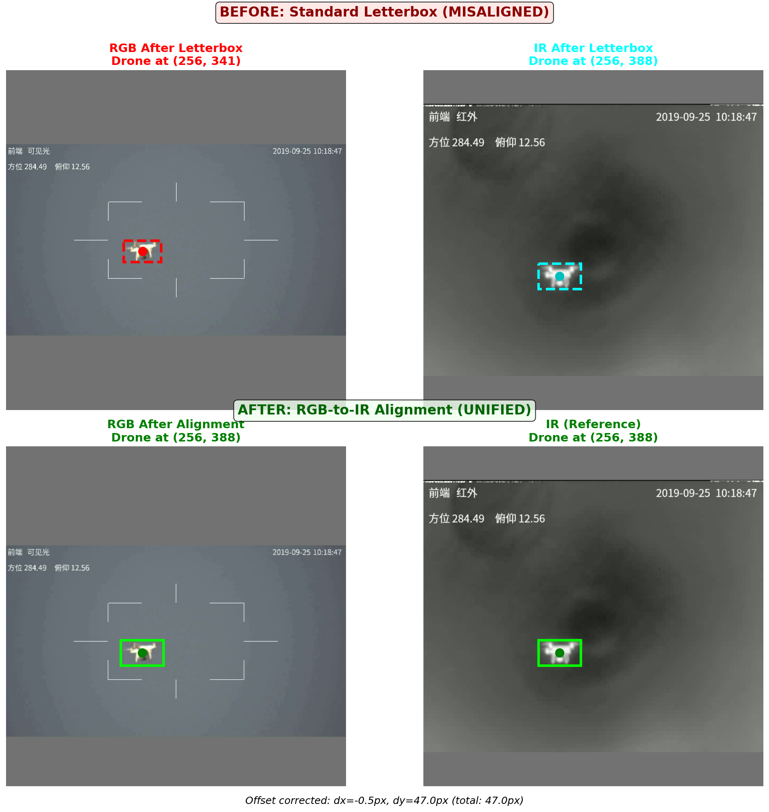
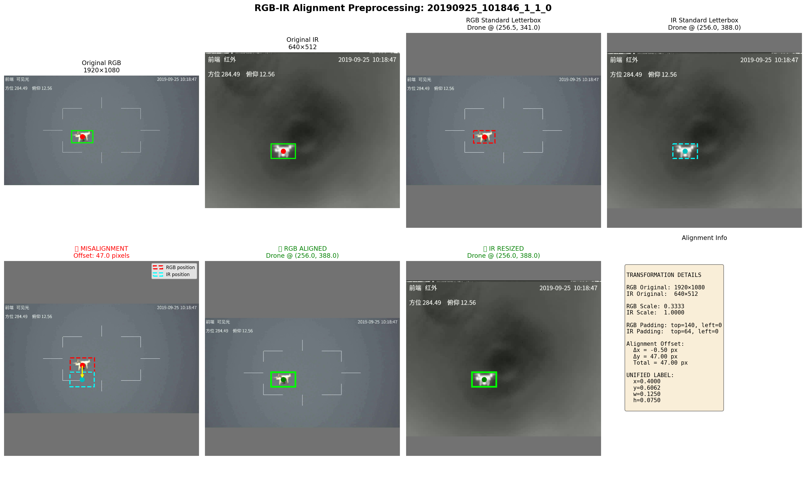

# Multi-Modal Data Preprocessing: RGB-IR Spatial Alignment

This document provides a detailed technical description of the preprocessing methodology used to spatially align RGB (visible) and IR (infrared/thermal) images for multi-modal sensor fusion in UAV detection.

---

## Table of Contents

1. [Problem Statement](#1-problem-statement)
2. [Mathematical Formulation](#2-mathematical-formulation)
3. [Standard Letterbox Resizing](#3-standard-letterbox-resizing)
4. [The Misalignment Problem](#4-the-misalignment-problem)
5. [RGB-to-IR Alignment Solution](#5-rgb-to-ir-alignment-solution)
6. [Algorithm Implementation](#6-algorithm-implementation)
7. [Visual Comparison](#7-visual-comparison)
8. [Unified Labeling](#8-unified-labeling)
9. [Usage](#9-usage)

---

## 1. Problem Statement

Multi-modal sensor fusion requires that features from different modalities (RGB and IR) correspond to the same spatial locations. However, RGB and IR cameras typically have:

- **Different resolutions**: RGB cameras often have higher resolution (e.g., 1920×1080) than thermal IR cameras (e.g., 640×512).
- **Different fields of view**: Even when co-located, the cameras may have slightly different optical characteristics.
- **Different aspect ratios**: This leads to different scaling factors during resizing.

When both images are independently resized to a common target size (e.g., 640×640) using standard letterboxing, the same real-world object (drone) may appear at **different pixel locations** in the two images. This spatial misalignment degrades fusion performance.

---

## 2. Mathematical Formulation

### 2.1 Notation

| Symbol | Description |
|--------|-------------|
| $W_{rgb}, H_{rgb}$ | Original RGB image dimensions |
| $W_{ir}, H_{ir}$ | Original IR image dimensions |
| $T$ | Target image size (640×640) |
| $(x_{rgb}, y_{rgb})$ | Drone center position in original RGB image (pixels) |
| $(x_{ir}, y_{ir})$ | Drone center position in original IR image (pixels) |
| $s$ | Scale factor during resizing |
| $(p_x, p_y)$ | Padding (left, top) after resizing |
| $(x', y')$ | Drone center position after transformation (pixels) |

### 2.2 YOLO Label Format

Labels are stored in normalized coordinates:

$$
\text{label} = (c, \hat{x}, \hat{y}, \hat{w}, \hat{h})
$$

Where:
- $c$ = class index
- $\hat{x} = x_{center} / W$ (normalized x-center)
- $\hat{y} = y_{center} / H$ (normalized y-center)
- $\hat{w} = w / W$ (normalized width)
- $\hat{h} = h / H$ (normalized height)

**Conversion to pixel coordinates:**

$$
x_{pixel} = \hat{x} \cdot W, \quad y_{pixel} = \hat{y} \cdot H
$$

---

## 3. Standard Letterbox Resizing

Letterbox resizing maintains aspect ratio by:
1. Scaling the image so the largest dimension fits the target size.
2. Padding the smaller dimension to reach the target size.

### 3.1 Scale Factor Calculation

$$
s = \min\left(\frac{T}{W}, \frac{T}{H}\right)
$$

### 3.2 New Dimensions After Scaling

$$
W_{new} = \lfloor W \cdot s \rfloor, \quad H_{new} = \lfloor H \cdot s \rfloor
$$

### 3.3 Padding Calculation

$$
p_x = \frac{T - W_{new}}{2}, \quad p_y = \frac{T - H_{new}}{2}
$$

### 3.4 Coordinate Transformation

After letterbox resizing, a point $(x, y)$ in the original image maps to $(x', y')$ in the resized image:

$$
\boxed{x' = x \cdot s + p_x, \quad y' = y \cdot s + p_y}
$$

---

## 4. The Misalignment Problem

### 4.1 Example Calculation

Consider a real example from the Anti-UAV dataset (Sample 1 from our visualizations):

| Property | RGB Image | IR Image |
|----------|-----------|----------|
| Original Size | 1920 × 1080 | 640 × 512 |
| Drone Position (normalized) | (0.4008, 0.5583) | (0.4000, 0.6328) |
| Drone Position (pixels) | (769.5, 603.0) | (256.0, 324.0) |

**Step 1: Calculate scale factors**

For RGB:
$$
s_{rgb} = \min\left(\frac{640}{1920}, \frac{640}{1080}\right) = \min(0.333, 0.593) = 0.333
$$

For IR:
$$
s_{ir} = \min\left(\frac{640}{640}, \frac{640}{512}\right) = \min(1.0, 1.25) = 1.0
$$

**Step 2: Calculate new dimensions**

For RGB:
$$
W_{rgb,new} = 1920 \times 0.333 = 640, \quad H_{rgb,new} = 1080 \times 0.333 = 360
$$

For IR:
$$
W_{ir,new} = 640 \times 1.0 = 640, \quad H_{ir,new} = 512 \times 1.0 = 512
$$

**Step 3: Calculate padding**

For RGB (padding is on top/bottom since height is smaller):
$$
p_{rgb,left} = \frac{640 - 640}{2} = 0, \quad p_{rgb,top} = \frac{640 - 360}{2} = 140
$$

For IR (padding is on top/bottom since height is smaller):
$$
p_{ir,left} = \frac{640 - 640}{2} = 0, \quad p_{ir,top} = \frac{640 - 512}{2} = 64
$$

**Step 4: Transform drone coordinates**

For RGB:
$$
x'_{rgb} = 769.5 \times 0.333 + 0 = 256.5
$$
$$
y'_{rgb} = 603.0 \times 0.333 + 140 = 341.0
$$

For IR:
$$
x'_{ir} = 256.0 \times 1.0 + 0 = 256.0
$$
$$
y'_{ir} = 324.0 \times 1.0 + 64 = 388.0
$$

### 4.2 Misalignment Result

| Modality | Drone Position After Letterbox |
|----------|-------------------------------|
| RGB | (256.5, 341.0) |
| IR | (256.0, 388.0) |
| **Offset** | **(-0.5, 47.0) pixels** |

The drone appears at different locations in the two images—primarily a **47 pixel vertical offset**. This makes a unified label impossible with standard preprocessing.

---

## 5. RGB-to-IR Alignment Solution

### 5.1 Strategy

We designate the **IR image as the reference** and transform the RGB image to align with the IR coordinate space. This involves:

1. Apply standard letterbox to IR (reference).
2. Apply standard letterbox to RGB.
3. Calculate the offset between drone positions.
4. Translate (shift) the RGB image by the offset.
5. Use the IR label as the unified label for both images.

### 5.2 Offset Calculation

$$
\boxed{\Delta x = x'_{ir} - x'_{rgb}, \quad \Delta y = y'_{ir} - y'_{rgb}}
$$

From our example:
$$
\Delta x = 256.0 - 256.5 = -0.5 \text{ pixels}
$$
$$
\Delta y = 388.0 - 341.0 = 47.0 \text{ pixels}
$$

### 5.3 Translation Transformation

The RGB image is shifted using an affine transformation:

$$
\mathbf{M} = \begin{bmatrix} 1 & 0 & \Delta x \\ 0 & 1 & \Delta y \end{bmatrix}
$$

Applied via:

$$
\begin{bmatrix} x'' \\ y'' \end{bmatrix} = \mathbf{M} \begin{bmatrix} x' \\ y' \\ 1 \end{bmatrix} = \begin{bmatrix} x' + \Delta x \\ y' + \Delta y \end{bmatrix}
$$

### 5.4 Aligned RGB Drone Position

After translation:
$$
x''_{rgb} = x'_{rgb} + \Delta x = 256.5 + (-0.5) = 256.0
$$
$$
y''_{rgb} = y'_{rgb} + \Delta y = 341.0 + 47.0 = 388.0
$$

**Result:** RGB drone position now matches IR drone position exactly at (256.0, 388.0).

---

## 6. Algorithm Implementation

### 6.1 Complete Pipeline

```
Input: RGB image (W_rgb × H_rgb), IR image (W_ir × H_ir)
       RGB label (normalized), IR label (normalized)
       Target size T (default: 640)

Output: Aligned RGB image (T × T), Resized IR image (T × T)
        Unified label (normalized)

Algorithm:
1. Parse labels to get drone positions in pixel coordinates
   x_rgb = label_rgb.x * W_rgb
   y_rgb = label_rgb.y * H_rgb
   x_ir = label_ir.x * W_ir
   y_ir = label_ir.y * H_ir

2. Apply standard letterbox to IR image
   s_ir = min(T/W_ir, T/H_ir)
   IR_resized = resize(IR, s_ir) + pad(T - s_ir*H_ir, T - s_ir*W_ir)
   x'_ir = x_ir * s_ir + pad_left_ir
   y'_ir = y_ir * s_ir + pad_top_ir

3. Apply standard letterbox to RGB image
   s_rgb = min(T/W_rgb, T/H_rgb)
   RGB_resized = resize(RGB, s_rgb) + pad(T - s_rgb*H_rgb, T - s_rgb*W_rgb)
   x'_rgb = x_rgb * s_rgb + pad_left_rgb
   y'_rgb = y_rgb * s_rgb + pad_top_rgb

4. Calculate alignment offset
   Δx = x'_ir - x'_rgb
   Δy = y'_ir - y'_rgb

5. Translate RGB image
   M = [[1, 0, Δx], [0, 1, Δy]]
   RGB_aligned = warpAffine(RGB_resized, M, (T, T), borderValue=(114,114,114))

6. Create unified label (use IR coordinates in target space)
   w'_ir = label_ir.w * W_ir * s_ir
   h'_ir = label_ir.h * H_ir * s_ir
   unified_label = (class, x'_ir/T, y'_ir/T, w'_ir/T, h'_ir/T)

Return: RGB_aligned, IR_resized, unified_label
```

### 6.2 Python Implementation

```python
def align_rgb_to_ir_coordinate_space(rgb_img, ir_img, rgb_label, ir_label, target_size=640):
    """
    Align RGB image to IR coordinate space for unified labeling.
    """
    rgb_h, rgb_w = rgb_img.shape[:2]
    ir_h, ir_w = ir_img.shape[:2]
    
    # Step 1: Parse labels to pixel coordinates
    rgb_drone_x = rgb_label['x'] * rgb_w
    rgb_drone_y = rgb_label['y'] * rgb_h
    ir_drone_x = ir_label['x'] * ir_w
    ir_drone_y = ir_label['y'] * ir_h
    
    # Step 2: Letterbox resize IR (reference)
    ir_resized, ir_scale, (ir_pad_top, ir_pad_left) = letterbox_resize(ir_img, target_size)
    ir_drone_x_resized = ir_drone_x * ir_scale + ir_pad_left
    ir_drone_y_resized = ir_drone_y * ir_scale + ir_pad_top
    
    # Step 3: Letterbox resize RGB
    rgb_resized, rgb_scale, (rgb_pad_top, rgb_pad_left) = letterbox_resize(rgb_img, target_size)
    rgb_drone_x_resized = rgb_drone_x * rgb_scale + rgb_pad_left
    rgb_drone_y_resized = rgb_drone_y * rgb_scale + rgb_pad_top
    
    # Step 4: Calculate offset
    offset_x = ir_drone_x_resized - rgb_drone_x_resized
    offset_y = ir_drone_y_resized - rgb_drone_y_resized
    
    # Step 5: Translate RGB
    M = np.float32([[1, 0, offset_x], [0, 1, offset_y]])
    rgb_aligned = cv2.warpAffine(rgb_resized, M, (target_size, target_size),
                                 borderMode=cv2.BORDER_CONSTANT, 
                                 borderValue=(114, 114, 114))
    
    # Step 6: Create unified label
    ir_drone_w_resized = ir_label['w'] * ir_w * ir_scale
    ir_drone_h_resized = ir_label['h'] * ir_h * ir_scale
    
    unified_label = {
        'class': ir_label['class'],
        'x': ir_drone_x_resized / target_size,
        'y': ir_drone_y_resized / target_size,
        'w': ir_drone_w_resized / target_size,
        'h': ir_drone_h_resized / target_size
    }
    
    return rgb_aligned, ir_resized, unified_label
```

---

## 7. Visual Comparison

### 7.0 Quick Visual Summary

The following figures provide an immediate visual understanding of the alignment problem and solution.

**Before vs After Alignment:**



**Misalignment Overlay and Aligned Blend:**


**Coordinate Transformation Diagram:**


### 7.1 Standard Letterbox (Misaligned)

When both images are independently letterboxed without alignment:

```
┌─────────────────────────────────────────────────────────────────┐
│                    STANDARD LETTERBOX RESULT                    │
├─────────────────────────────┬───────────────────────────────────┤
│         RGB (640×640)       │          IR (640×640)             │
│                             │                                   │
│    ┌─────────────────┐      │    ┌─────────────────────────┐    │
│    │ padding (140px) │      │    │     padding (64px)      │    │
│    ├─────────────────┤      │    ├─────────────────────────┤    │
│    │       X         │      │    │                         │    │
│    │   (257, 341)    │      │    │                         │    │
│    │   RGB drone     │      │    │           X             │    │
│    │                 │      │    │       (256, 388)        │    │
│    │                 │      │    │       IR drone          │    │
│    ├─────────────────┤      │    ├─────────────────────────┤    │
│    │ padding (140px) │      │    │     padding (64px)      │    │
│    └─────────────────┘      │    └─────────────────────────┘    │
│                             │                                   │
│  RGB drone higher up        │  IR drone lower down              │
│  (less top padding)         │  (less top padding)               │
└─────────────────────────────┴───────────────────────────────────┘
                    MISALIGNED BY ~47 PIXELS VERTICALLY
```

### 7.2 RGB-to-IR Alignment (Aligned)

After applying our alignment transformation:

```
┌─────────────────────────────────────────────────────────────────┐
│                   RGB-TO-IR ALIGNED RESULT                      │
├─────────────────────────────┬───────────────────────────────────┤
│     RGB Aligned (640×640)   │       IR Resized (640×640)        │
│                             │                                   │
│    ┌─────────────────┐      │    ┌─────────────────────────┐    │
│    │ shifted content │      │    │     padding (64px)      │    │
│    │ (down by 47px)  │      │    ├─────────────────────────┤    │
│    ├─────────────────┤      │    │                         │    │
│    │                 │      │    │                         │    │
│    │       O         │      │    │           O             │    │
│    │   (256, 388)    │      │    │       (256, 388)        │    │
│    │                 │      │    │                         │    │
│    ├─────────────────┤      │    ├─────────────────────────┤    │
│    │ shifted content │      │    │     padding (64px)      │    │
│    └─────────────────┘      │    └─────────────────────────┘    │
│                             │                                   │
│  Drone positions match!     │  Drone positions match!           │
└─────────────────────────────┴───────────────────────────────────┘
                    PERFECTLY ALIGNED (0 PIXELS OFFSET)
```

### 7.3 Real Sample Visualizations

The following visualizations show actual samples from the Anti-UAV training dataset. Each figure demonstrates the complete preprocessing pipeline.

**Sample 1: Anti-UAV Training Pair**



**Sample 2: Anti-UAV Training Pair**


**Figure Explanation:**

| Panel | Description |
|-------|-------------|
| **Row 1, Left** | Original RGB image (1920×1080) with ground truth bounding box |
| **Row 1, Middle-Left** | Original IR image (640×512) with ground truth bounding box |
| **Row 1, Middle-Right** | RGB after standard letterbox - drone position marked in **red** |
| **Row 1, Right** | IR after standard letterbox - drone position marked in **cyan** |
| **Row 2, Left** | Misalignment overlay showing ~47 pixel offset between RGB (red) and IR (cyan) positions |
| **Row 2, Middle** | RGB after alignment - drone now at **green** unified position |
| **Row 2, Middle-Right** | IR resized - drone at same **green** unified position |
| **Row 2, Right** | Transformation details and unified label values |

**Key Observations:**
- The misalignment in these samples is approximately **47 pixels** vertically
- After alignment, both modalities have the drone at **identical pixel coordinates**
- The unified label (shown in green) correctly describes the drone in both images

### 7.4 Preprocessed Dataset Samples

The following shows actual preprocessed data from the training set, demonstrating that the unified labels correctly apply to both aligned RGB and resized IR images:


---

## 8. Unified Labeling

### 8.1 Benefits of Unified Labels

| Aspect | Separate Labels | Unified Label |
|--------|-----------------|---------------|
| Files per pair | 2 (RGB + IR) | 1 |
| Spatial alignment | Not guaranteed | Guaranteed |
| Feature fusion | Misaligned features | Aligned features |
| Training complexity | Higher | Lower |
| Ground truth consistency | May differ | Identical |

### 8.2 Label File Structure

After preprocessing, each image pair shares a single label file:

```
data/anti-uav/
├── images/
│   └── train_resized/
│       ├── rgb/
│       │   └── 20190925_130434_1_4_385.jpg  ← Aligned RGB
│       └── ir/
│           └── 20190925_130434_1_4_385.jpg  ← Resized IR
└── labels/
    └── train_resized/
        └── 20190925_130434_1_4_385.txt      ← Unified label (applies to both!)
```

### 8.3 Label Content

```
# 20190925_130434_1_4_385.txt
0 0.611719 0.596875 0.042188 0.037500
```

This single label correctly describes the drone location in **both** the aligned RGB and resized IR images.

---

## 9. Usage

### 9.1 Single Pair Alignment

```python
from resize_data.align_rgb_to_ir import align_rgb_to_ir_coordinate_space

# Load images and labels
rgb_img = cv2.imread("rgb_image.jpg")
ir_img = cv2.imread("ir_image.jpg")
rgb_label = "0 0.577 0.607 0.045 0.040"
ir_label = "0 0.612 0.621 0.042 0.047"

# Align
rgb_aligned, ir_resized, unified_label = align_rgb_to_ir_coordinate_space(
    rgb_img, ir_img, rgb_label, ir_label, target_size=640
)

# Save
cv2.imwrite("rgb_aligned.jpg", rgb_aligned)
cv2.imwrite("ir_resized.jpg", ir_resized)
with open("unified_label.txt", "w") as f:
    f.write(unified_label)
```

### 9.2 Batch Processing

```bash
python resize_data/batch_process_aligned.py \
    --root /path/to/anti-uav \
    --target-size 640
```

This processes all train/val/test sets and creates:
- `images/{set}_resized/rgb/` - Aligned RGB images
- `images/{set}_resized/ir/` - Resized IR images
- `labels/{set}_resized/` - Unified labels

---

## Summary

| Step | Operation | Formula |
|------|-----------|---------|
| 1 | Letterbox IR | $s_{ir} = \min(T/W_{ir}, T/H_{ir})$ |
| 2 | Letterbox RGB | $s_{rgb} = \min(T/W_{rgb}, T/H_{rgb})$ |
| 3 | Transform IR coords | $x'_{ir} = x_{ir} \cdot s_{ir} + p_{ir,x}$ |
| 4 | Transform RGB coords | $x'_{rgb} = x_{rgb} \cdot s_{rgb} + p_{rgb,x}$ |
| 5 | Calculate offset | $\Delta x = x'_{ir} - x'_{rgb}$ |
| 6 | Translate RGB | $x''_{rgb} = x'_{rgb} + \Delta x$ |
| 7 | Create unified label | Use $(x'_{ir}, y'_{ir})$ normalized to $T$ |

**Result:** Both modalities have the drone at identical pixel coordinates, enabling effective feature-level fusion with a single ground-truth label.

---

## References

- Original YOLOv5 letterbox implementation: [ultralytics/yolov5](https://github.com/ultralytics/yolov5)
- Anti-UAV Dataset: [Anti-UAV Challenge](https://anti-uav.github.io/)

