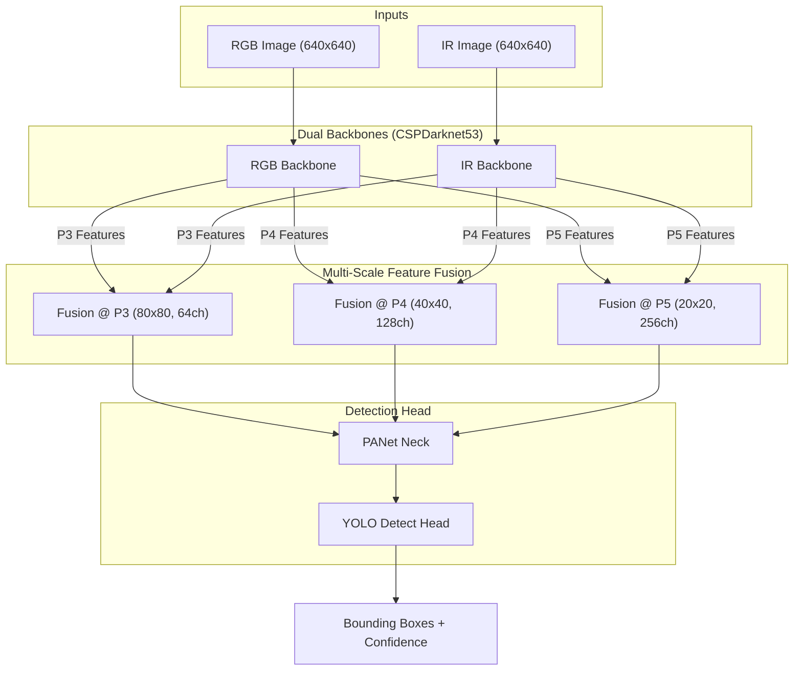
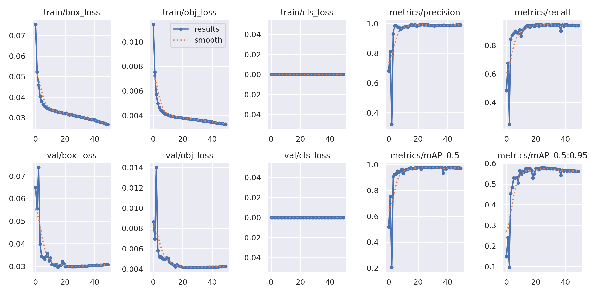
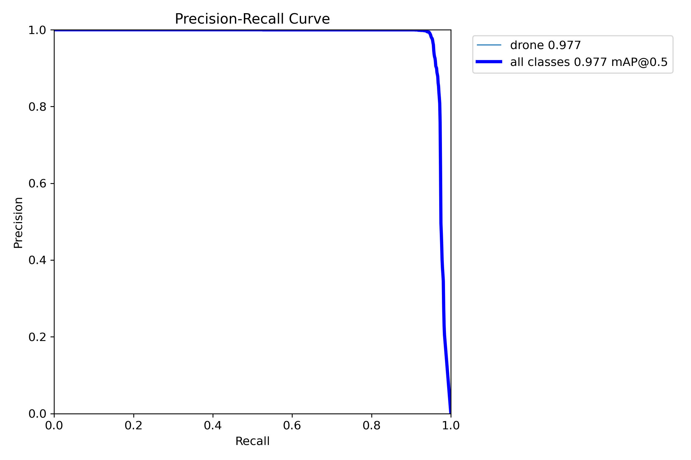
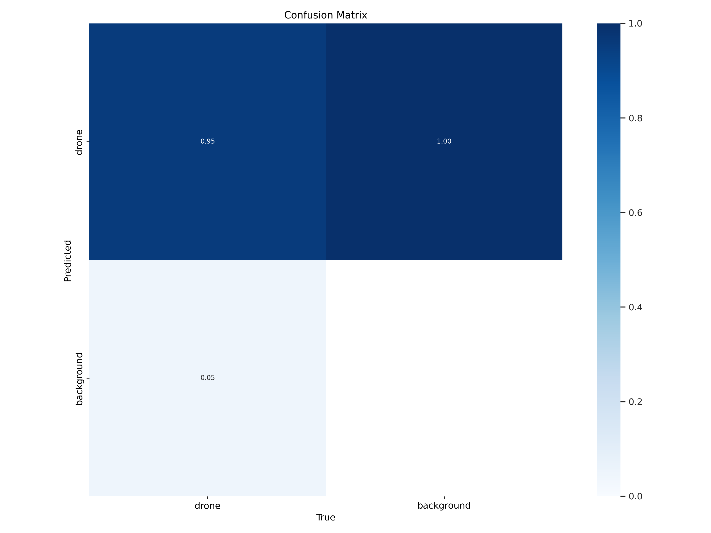
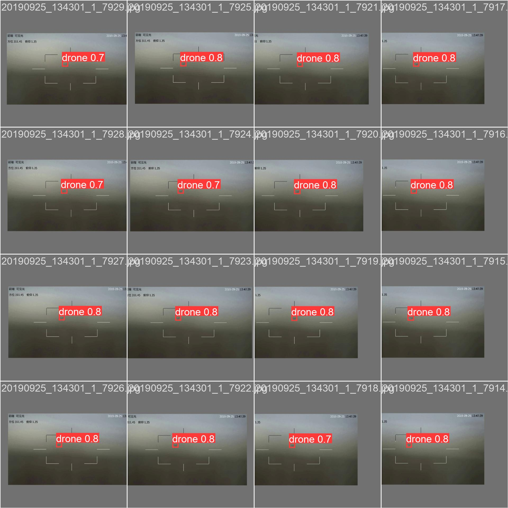
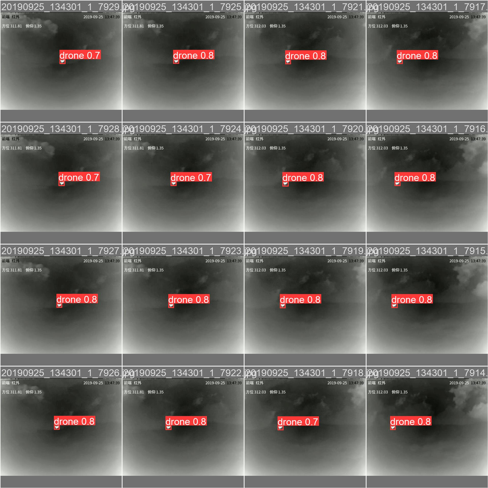
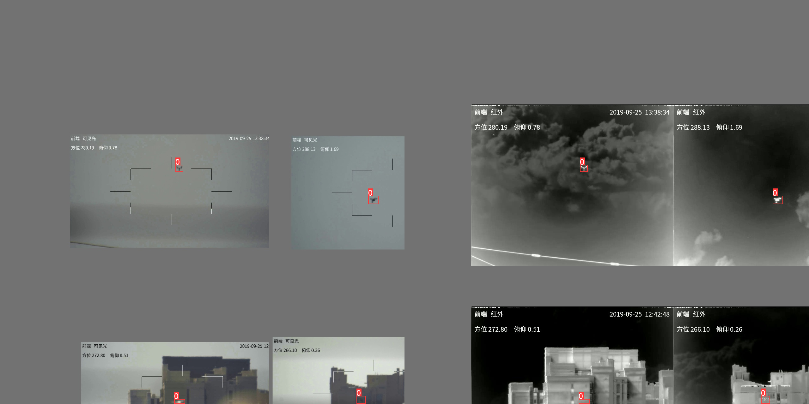

<div align="center">
  <p>
    <a href="https://github.com/Tigran98/yolo5_UAV" target="_blank">
      </a>
  </p>

  <a href="https://github.com/Tigran98/yolo5_UAV/actions"></a>
  <a href="https://github.com/Tigran98/yolo5_UAV/issues"></a>
  <a href="https://github.com/Tigran98/yolo5_UAV/stargazers"></a>
  <a href="https://github.com/Tigran98/yolo5_UAV/blob/main/LICENSE"></a>

</div>

# 🚁 YOLOv5 Dual-Stream Sensor Fusion for UAV Detection

<p align="center">
  
  
  
  
</p>

This repository implements a **Dual-Stream Multi-Modal Sensor Fusion** architecture based on YOLOv5 for robust UAV (drone) detection. The system fuses **Visible (RGB)** and **Infrared (IR/Thermal)** imagery at the feature level to achieve superior detection performance across varying lighting and environmental conditions.

> **Key Innovation**: This system utilizes two parallel CSPDarknet backbones to independently extract features from spatially-aligned RGB and IR images. These features are then fused at multiple scales (P3, P4, P5) using a concatenation-convolution mechanism before being passed to the detection head. This approach combines the rich texture and color information of RGB with the thermal contrast and illumination-invariance of IR.

---

## 📋 Table of Contents

- [Key Features](#-key-features)
- [Fusion Architecture](#-fusion-architecture)
- [Data Preprocessing](#-data-preprocessing-rgb-ir-alignment)
- [Experimental Results](#-experimental-results)
- [Installation](#-installation)
- [Usage](#-usage)
- [Project Structure](#-project-structure)
- [Deployment](#-deployment)
- [Citation](#-citation)
- [License](#-license)

---

## 🌟 Key Features

| Feature | Description |
|---------|-------------|
| **Dual-Backbone Architecture** | Two independent CSPDarknet53 backbones process RGB and IR streams in parallel. |
| **Multi-Scale Feature Fusion** | Features are fused at P3 (stride 8), P4 (stride 16), and P5 (stride 32) using `Concat + 1×1 Conv`. |
| **Synchronized Augmentation** | Custom dataloaders apply identical geometric augmentations (flips, perspective, mosaic) to both image pairs to maintain spatial alignment. |
| **Unified Labeling** | A novel RGB-to-IR alignment preprocessing pipeline ensures a single ground-truth label applies to both modalities. |
| **Edge Optimized** | Designed for deployment on NVIDIA Jetson and FPGA platforms (ONNX, TensorRT, Vitis AI support). |

---

## 🏗️ Fusion Architecture

The core of this work is the **Feature-Level Fusion** strategy. Instead of simply concatenating raw images or fusing predictions (decision-level fusion), we fuse intermediate feature maps from both modalities at multiple scales.

### Architecture Diagram



### Fusion Mechanism: `FeatureFusion` Module

The fusion is performed by the `FeatureFusion` class in `models/common.py`:

```python
class FeatureFusion(nn.Module):
    """Fuses RGB and IR features using concatenation + 1x1 convolution."""
    def __init__(self, c1):
        super().__init__()
        # Concatenate features (c1 * 2) and reduce back to c1 with 1x1 conv
        self.fuse = Conv(c1 * 2, c1, k=1, s=1)

    def forward(self, x_rgb, x_ir):
        # x_rgb: (B, C, H, W), x_ir: (B, C, H, W)
        x = torch.cat([x_rgb, x_ir], dim=1)  # (B, 2C, H, W)
        return self.fuse(x)  # (B, C, H, W)
```

**Why Concatenation + 1x1 Conv?**
- **Concatenation** preserves all information from both modalities.
- The **1x1 convolution** learns to weight and combine channels from both streams, acting as a learnable attention mechanism over the fused features. It also reduces the channel dimension back to the original size, maintaining compatibility with the standard YOLOv5 PANet neck.

---

## 🔧 Data Preprocessing: RGB-IR Alignment

A critical challenge in multi-modal fusion is ensuring **spatial alignment** between the RGB and IR images. Due to different camera resolutions and fields of view, a drone may appear at different pixel locations in the two modalities even when captured simultaneously.

### The Problem

| Modality | Original Resolution | Drone Position (pixels) |
|----------|---------------------|-------------------------|
| RGB | 1920 × 1080 | (1107.5, 655.5) |
| IR | 640 × 512 | (391.5, 318.0) |

After standard letterbox resizing to 640×640, the drone positions **do not align**:
- RGB (letterboxed): (369.2, 358.5)
- IR (letterboxed): (391.5, 382.0)
- **Offset: ~23.5 pixels!**

This misalignment degrades fusion performance because features from different spatial locations are incorrectly combined.

### The Solution: RGB-to-IR Coordinate Space Alignment

We developed a preprocessing pipeline (`resize_data/align_rgb_to_ir.py`) that:
1.  Resizes the IR image using standard letterboxing (this becomes the reference).
2.  Resizes the RGB image, then **translates (shifts)** it to align the drone's position with the IR image.
3.  Uses the **IR label as the unified label** for both modalities.

**Result:** After alignment, the drone appears at the **same pixel coordinates** in both 640×640 images, and a single YOLO-format label applies to both.

```
Before Alignment:          After Alignment:
┌───────────┐ ┌───────────┐    ┌───────────┐ ┌───────────┐
│   RGB     │ │    IR     │    │   RGB     │ │    IR     │
│     🔴    │ │           │    │           │ │           │
│           │ │     🔴    │ => │     🔴    │ │     🔴    │  ← Aligned!
│           │ │           │    │           │ │           │
└───────────┘ └───────────┘    └───────────┘ └───────────┘
  Offset: 23px                   Offset: 0px
```

### Dataset Structure (Post-Alignment)

```
data/anti-uav/
├── images/
│   ├── train_resized/
│   │   ├── rgb/        # Aligned RGB images (640x640)
│   │   └── ir/         # Resized IR images (640x640)
│   └── val_resized/
│       ├── rgb/
│       └── ir/
└── labels/
    ├── train_resized/  # Unified labels (one .txt per image pair)
    └── val_resized/
```

---

## 📊 Experimental Results

We conducted extensive experiments on the **Anti-UAV dataset** to compare:
1.  **RGB Only**: Standard YOLOv5n trained on visible images.
2.  **IR Only**: Standard YOLOv5n trained on thermal infrared images.
3.  **RGB+IR Fusion**: Our dual-stream fusion model.

### Training Configuration

| Parameter | Fusion Model | Single-Stream Models |
|-----------|--------------|----------------------|
| Base Model | YOLOv5n | YOLOv5n |
| Input Size | 640 × 640 | 640 × 640 |
| Epochs | 50 | 100 |
| Batch Size | 96 | 64 |
| Optimizer | SGD (momentum=0.937) | SGD (momentum=0.937) |
| Learning Rate | 0.01 → 0.0001 | 0.01 → 0.0001 |

### Quantitative Results

| Model | Precision | Recall | mAP@0.5 | mAP@0.5:0.95 | Best Epoch |
|-------|-----------|--------|---------|--------------|------------|
| **RGB+IR Fusion** | **99.1%** | **94.9%** | **97.7%** | **58.0%** | **24** |
| IR Only | 98.3% | 91.3% | 94.9% | 51.0% | 8 |
| RGB Only | 96.4% | 77.0% | 85.6% | 42.9% | 15 |

### Key Findings

1.  **Fusion achieves the highest mAP@0.5 (97.7%)**, outperforming IR-only by **+2.8%** and RGB-only by **+12.1%**.
2.  **Fusion achieves the highest mAP@0.5:0.95 (58.0%)**, indicating better localization accuracy. This is **+7.0%** over IR-only and **+15.1%** over RGB-only.
3.  **Fusion has the best Recall (94.9%)**, meaning it detects more drones with fewer misses.
4.  **IR-only converges faster** (best at epoch 8), while Fusion continues to improve until epoch 24.
5.  **RGB-only struggles with recall (77.0%)**, likely due to complex backgrounds and varying lighting.

### Training Curves Comparison

<div align="center">
  <table>
    <tr>
      <td align="center"><b>RGB+IR Fusion (50 epochs)</b></td>
      <td align="center"><b>IR Only (100 epochs)</b></td>
      <td align="center"><b>RGB Only (100 epochs)</b></td>
    </tr>
    <tr>
      <td></td>
      <td></td>
      <td></td>
    </tr>
  </table>
  <p><i>Training metrics: Box Loss, Objectness Loss, Precision, Recall, mAP curves.</i></p>
</div>

### Precision-Recall Curves

<div align="center">
  <table>
    <tr>
      <td align="center"><b>Fusion PR Curve</b></td>
      <td align="center"><b>IR Only PR Curve</b></td>
      <td align="center"><b>RGB Only PR Curve</b></td>
    </tr>
    <tr>
      <td></td>
      <td></td>
      <td></td>
    </tr>
  </table>
</div>

### Confusion Matrices

<div align="center">
  <table>
    <tr>
      <td align="center"><b>Fusion</b></td>
      <td align="center"><b>IR Only</b></td>
      <td align="center"><b>RGB Only</b></td>
    </tr>
    <tr>
      <td></td>
      <td></td>
      <td></td>
    </tr>
  </table>
</div>

### Validation Predictions (Fusion Model)

The fusion model produces predictions on both RGB and IR validation images using the same bounding boxes:

<div align="center">
  <table>
    <tr>
      <td align="center"><b>RGB Predictions</b></td>
      <td align="center"><b>IR Predictions</b></td>
    </tr>
    <tr>
      <td></td>
      <td></td>
    </tr>
  </table>
  <p><i>Validation batch predictions showing aligned detections on both modalities.</i></p>
</div>

### Aligned Sample Visualization

During training, we save aligned RGB-IR pairs to verify spatial alignment:

<div align="center">
  
  <p><i>Example of aligned RGB-IR pair with unified bounding box. The same label applies to both images.</i></p>
</div>

---

## 🚀 Installation

### Prerequisites

- Python >= 3.8
- PyTorch >= 1.8
- CUDA >= 10.2 (for GPU training)

### Setup

```bash
# Clone the repository
git clone https://github.com/Tigran98/yolo5_UAV.git
cd yolo5_UAV

# Create virtual environment (recommended)
python -m venv venv
source venv/bin/activate  # On Windows: venv\Scripts\activate

# Install dependencies
pip install -r requirements.txt
```

---

## 🎓 Usage

### 1. Data Preprocessing (Alignment)

If you have raw RGB and IR images with separate labels, align them first:

```bash
python resize_data/batch_process_aligned.py \
  --rgb-train /path/to/train/rgb \
  --ir-train /path/to/train/ir \
  --rgb-train-labels /path/to/train/rgb/labels \
  --ir-train-labels /path/to/train/ir/labels \
  --output ./data/anti-uav
```

### 2. Training the Fusion Model

```bash
python train_fusion.py \
    --data data/anti_uav_fusion.yaml \
    --cfg models/yolov5n_fusion.yaml \
    --weights yolov5n.pt \
    --epochs 50 \
    --batch-size 96 \
    --img 640 \
    --name fusion_experiment
```

**Key Arguments:**
- `--data`: Dataset YAML pointing to aligned RGB/IR directories.
- `--cfg`: Fusion model architecture definition.
- `--weights`: Pre-trained YOLOv5 weights (loaded into both backbones).

### 3. Validation

```bash
python val_fusion.py \
    --weights runs/train/fusion_experiment/weights/best.pt \
    --data data/anti_uav_fusion.yaml \
    --img 640 \
    --batch-size 32
```

### 4. Inference

For inference on a directory containing `rgb/` and `ir/` subdirectories:

```bash
python detect_fusion.py \
    --weights runs/train/fusion_experiment/weights/best.pt \
    --source path/to/test_images/ \
    --img 640 \
    --conf-thres 0.25 \
    --view-img
```

---

## 📁 Project Structure

```
yolov5_backup/
├── models/
│   ├── fusion_model.py          # YOLOv5FusionModel class (dual backbones)
│   ├── yolov5n_fusion.yaml      # Fusion model architecture definition
│   ├── common.py                # FeatureFusion module
│   └── yolo.py                  # Base model classes
├── utils/
│   └── fusion_dataloaders.py    # DualModalDataset, synchronized augmentation
├── data/
│   └── anti_uav_fusion.yaml     # Dataset configuration
├── resize_data/
│   ├── align_rgb_to_ir.py       # RGB-to-IR alignment function
│   ├── batch_process_aligned.py # Batch preprocessing script
│   └── UNIFIED_LABELING_GUIDE.md # Detailed alignment documentation
├── train_fusion.py              # Training script for fusion model
├── val_fusion.py                # Validation script
├── detect_fusion.py             # Inference script
├── runs/
│   ├── train/fusion_sync_50_640/ # Fusion experiment results
│   ├── exp_IR/                   # IR-only baseline results
│   └── exp_RGB/                  # RGB-only baseline results
└── README.md                    # This file
```

---

## 🛠️ Deployment

### ONNX Export

```bash
python export.py --weights runs/train/fusion_experiment/weights/best.pt --include onnx --simplify
```

### TensorRT (Jetson)

```bash
# On Jetson device
trtexec --onnx=best.onnx --saveEngine=best.engine --fp16
```

### FPGA (Vitis AI)

See `FUSION_MODEL_USAGE.md` for detailed Vitis AI quantization and deployment instructions.

---

## 📝 Citation

If you use this code in your research, please cite:

```bibtex
@misc{yolov5_uav_fusion,
  title={YOLOv5 Dual-Stream Sensor Fusion for UAV Detection},
  author={Tigran98},
  year={2024},
  publisher={GitHub},
  url={https://github.com/Tigran98/yolo5_UAV}
}
```

---

## 📄 License

This project is licensed under the **AGPL-3.0 License**. See the [LICENSE](LICENSE) file for details.

---

<div align="center">
  <p>Made with ❤️ for UAV Detection Research</p>
</div>
